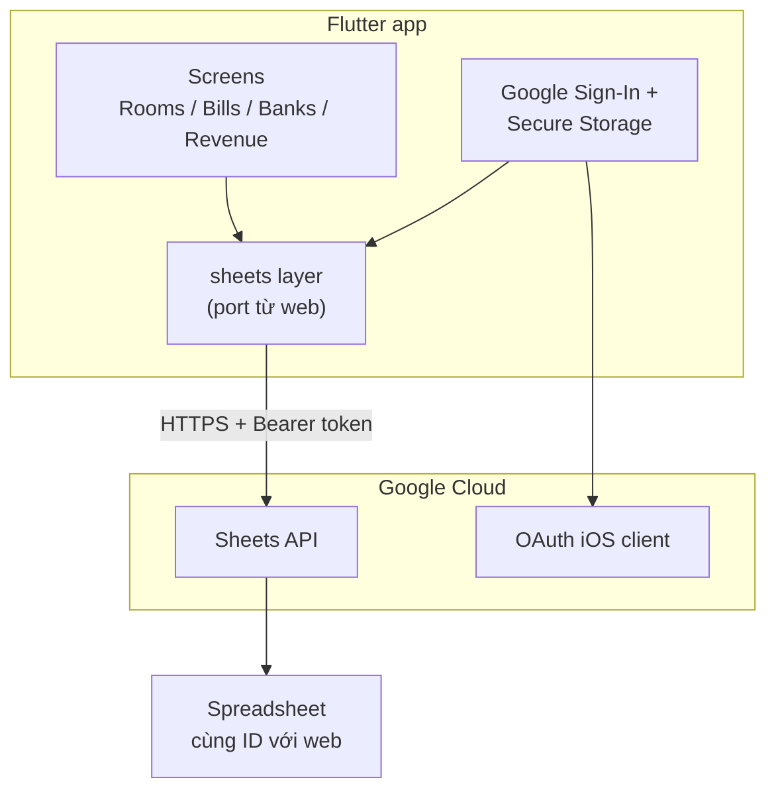

# Plan: Flutter app quản lý phòng trọ (Direct Google Sheets)

> Tài liệu plan triển khai app mobile Flutter — kết nối trực tiếp Google Sheets API, không qua Next.js backend.
> Web app hiện tại vẫn giữ nguyên; mobile và web dùng **cùng spreadsheet**.

**Spreadsheet ID:** `1JRTw0JdfMroakOY9B-J3B88WdMaNLTRYrWxC0u5zSvo`

**Liên quan:**

- [PROJECT_DOCS.md §10 — Mobile Flutter](./PROJECT_DOCS.md#10-mobile-flutter-app-mobile) — **tài liệu chính** (review, cấu trúc, màn hình, parity web)
- [PROJECT_DOCS.md](./PROJECT_DOCS.md) — kiến trúc web + spreadsheet chung

---

## Tiến độ phase

Cập nhật khi bạn nói *"complete phase N"*.

| Phase | Mô tả | Trạng thái |
|-------|--------|------------|
| **0** | Chuẩn bị môi trường (Flutter, Xcode, iPhone) | ✅ Hoàn thành |
| **1** | Google Cloud: OAuth client iOS | ✅ Hoàn thành (login Google OK trên iPhone) |
| **2** | Tạo project Flutter (`mobile/`) | ✅ Hoàn thành |
| **3** | Cấu hình iOS (Bundle ID, URL scheme, auth) | ✅ Hoàn thành |
| **4** | Port data layer (web → Dart) | ✅ Hoàn thành (đã verify trên iPhone) |
| **5** | UI screens | ✅ Hoàn thành (bottom nav: Phòng / Hóa đơn / NH / Doanh thu) |
| **6** | Build lên iPhone | ✅ Hoàn thành (`flutter run --release`) |
| **7** | Android (sau này) | ⬜ Chưa / tùy chọn |

**Phase hiện tại:** 5 (polish tùy chọn) / sẵn sàng dùng hàng ngày

---

## 1) Tóm tắt quyết định kiến trúc

| Hạng mục | Quyết định |
|----------|------------|
| Framework | Flutter (iOS trước, Android sau) |
| Data source | Google Spreadsheet — cùng file với web |
| Auth | Google Sign-In trên device → gọi Sheets API trực tiếp |
| Backend Next.js | **Không bắt buộc** cho mobile |
| Google OAuth client | **Thêm** iOS client; **giữ** Web client cho Next.js |
| App Store / Apple Developer trả phí | **Không cần** (app cá nhân, sideload) |



### Lưu ý quan trọng

- App **Google Sheets** trên iPhone **không** thay thế OAuth — dữ liệu nằm trên cloud, app Flutter phải gọi API.
- OAuth consent screen ở trạng thái **Testing**: email đăng nhập phải nằm trong **Test users**; có thể thấy màn "Google hasn't verified this app".
- Refresh token ở Testing mode có thể hết hạn **~7 ngày** → đăng nhập Google lại (độc lập với sideload Apple 7 ngày).
- Google **không chặn** build local / sideload — chỉ cần **Bundle ID khớp** OAuth client iOS.

---

## 2) Phase 0 — Chuẩn bị môi trường (1 lần)

| Việc | Ghi chú | Done |
|------|---------|------|
| Cài Flutter SDK | `brew install --cask flutter` → 3.44.0 stable | ✅ (CLI) |
| Cài CocoaPods | `brew install cocoapods` | ✅ (CLI) |
| Cài Xcode (full app) | Xcode **26.5** tại `/Applications/Xcode.app` | ✅ |
| Accept Xcode license | `sudo xcodebuild -license accept` | ✅ |
| `xcode-select` trỏ Xcode | `/Applications/Xcode.app` | ✅ |
| Setup script (`scripts/`) | Đã xóa — mobile đã bootstrap xong | ✅ (không cần nữa) |
| Apple ID trên Xcode | Personal Team (VLZBVGR3V9) | ✅ |
| iPhone | Ghép nối Xcode + Developer Mode | ✅ |
| Signing Xcode (Personal Team) | Runner → Signing & Capabilities → Team | ✅ |
| App chạy trên thiết bị | `flutter run --release` | ✅ |
| Chốt Bundle ID | `com.sonnguyen.managementmyself` | ✅ (đã chốt trong plan) |

### Bundle ID cố định

Chọn **một lần**, dùng xuyên suốt Google Cloud + Xcode + Flutter:

```text
com.sonnguyen.managementmyself
```

Đổi prefix `com.sonnguyen` theo ý bạn — **không đổi** sau khi đã tạo OAuth client iOS.

### Cài app lên iPhone (free, không App Store)

1. Xcode → Signing → Personal Team
2. `flutter run -d <iphone_id>`
3. iPhone: Settings → General → VPN & Device Management → Trust
4. App sideload free hết hạn ~7 ngày → cắm lại Mac, `flutter run` cài lại

**Không cần:** Apple Developer Program $99/năm, App Store, TestFlight.

---

## 3) Phase 1 — Google Cloud: OAuth client iOS

### 3.1 Vào project hiện tại

1. Mở [Google Cloud Console](https://console.cloud.google.com/)
2. Chọn **cùng project** đang dùng cho web
3. Không cần tạo project mới

### 3.2 OAuth consent screen

1. **APIs & Services → OAuth consent screen**
2. Giữ **External** + trạng thái **Testing**
3. **Test users** → thêm email Google dùng trên iPhone
4. **Scopes** — đảm bảo có:
   - `https://www.googleapis.com/auth/spreadsheets`
   - `https://www.googleapis.com/auth/userinfo.email`
5. **Save** — không cần Publish production

### 3.3 Bật API

**APIs & Services → Library:**

| API | Bắt buộc |
|-----|----------|
| Google Sheets API | Có |
| Google Drive API | Nên bật (tạo tab `bill_*`, bootstrap sheet) |

### 3.4 Tạo OAuth client iOS

1. **APIs & Services → Credentials**
2. **+ Create Credentials → OAuth client ID**
3. Application type: **iOS**
4. Điền:
   - **Name:** `ManagementMyself iOS` (tùy ý)
   - **Bundle ID:** `com.sonnguyen.managementmyself` — khớp 100% với Flutter/Xcode
5. **Create**
6. Copy **Client ID** → lưu làm `IOS_CLIENT_ID`

**Không cần** Client Secret cho iOS client.

**Không xóa** Web OAuth client đang dùng cho Next.js.

### 3.5 Web Client ID cho `serverClientId`

Flutter `google_sign_in` trên iOS cần **cả hai**:

| ID | Vai trò |
|----|---------|
| **iOS Client ID** | Sign-in native trên iPhone |
| **Web Client ID** (đang có cho Next.js) | Truyền vào `serverClientId` để lấy access token gọi Sheets API |

Ví dụ config Dart:

```dart
// lib/config/google_config.dart
class GoogleConfig {
  static const iosClientId = 'YOUR_IOS_CLIENT_ID.apps.googleusercontent.com';
  static const webClientId = 'YOUR_WEB_CLIENT_ID.apps.googleusercontent.com';
  static const spreadsheetId = '1JRTw0JdfMroakOY9B-J3B88WdMaNLTRYrWxC0u5zSvo';
  static const scopes = [
    'https://www.googleapis.com/auth/spreadsheets',
    'email',
  ];
}
```

---

## 4) Phase 2 — Tạo project Flutter

```bash
cd /path/to/ManagementMyself
flutter create mobile --org com.sonnguyen --project-name management_myself
cd mobile
```

### Packages gợi ý (`pubspec.yaml`)

```yaml
dependencies:
  flutter:
    sdk: flutter
  google_sign_in: ^6.2.2
  googleapis: ^13.2.0
  googleapis_auth: ^1.6.0
  flutter_secure_storage: ^9.2.4
  go_router: ^14.6.2
  flutter_riverpod: ^2.6.1
  intl: ^0.19.0
  uuid: ^4.5.1
```

### Cấu trúc thư mục

```text
mobile/lib/
  config/
    google_config.dart
    sheet_columns.dart          # port googleSheets.config.ts
  auth/
    google_auth_service.dart
  sheets/
    sheets_client.dart          # port frontend/src/server/google/sheetsClient.ts
    sheet_names.dart            # port billSheetNames.ts, sheetNames.ts
    mappers/
      room_mapper.dart
      room_bill_mapper.dart
      account_bank_mapper.dart
    calculations/
      room_bill_calc.dart
    repositories/
      rooms_repository.dart
      room_bills_repository.dart
      account_banks_repository.dart
  features/
    login/
    rooms/
    room_bills/
    account_banks/
    revenue/
  utils/
    format.dart
    viet_qr.dart                # port frontend/src/lib/vietQr.ts
```

---

## 5) Phase 3 — Cấu hình iOS

### 5.1 Bundle ID trong Xcode

1. `open ios/Runner.xcworkspace`
2. Runner → **Signing & Capabilities**
3. Team = Apple ID (Personal Team)
4. **Bundle Identifier** = `com.sonnguyen.managementmyself`

### 5.2 URL scheme (Google Sign-In callback)

Trong `ios/Runner/Info.plist`:

```xml
<key>CFBundleURLTypes</key>
<array>
  <dict>
    <key>CFBundleTypeRole</key>
    <string>Editor</string>
    <key>CFBundleURLSchemes</key>
    <array>
      <!-- Reversed iOS Client ID -->
      <!-- VD: client 123456-abc.apps.googleusercontent.com -->
      <!-- → com.googleusercontent.apps.123456-abc -->
      <string>com.googleusercontent.apps.YOUR_IOS_CLIENT_PREFIX</string>
    </array>
  </dict>
</array>
```

### 5.3 Auth service — luồng cốt lõi

1. `GoogleSignIn(serverClientId: webClientId, scopes: ...)`
2. `signIn()` → user chọn account
3. Lấy `authentication.accessToken`
4. Tạo HTTP client cho package `googleapis` / `googleapis_auth`
5. Lưu email vào `flutter_secure_storage`
6. Mỗi lần mở app: `signInSilently()` → fail thì về Login

---

## 6) Phase 4 — Port data layer (web → Dart)

Port theo thứ tự dependency:

| # | Web (TypeScript) | Flutter (Dart) | Ưu tiên |
|---|------------------|----------------|---------|
| 1 | `frontend/src/config/googleSheets.config.ts` | `sheet_columns.dart` | P0 |
| 2 | `frontend/src/config/billSheetNames.ts`, `lib/sheets/sheetNames.ts` | `sheet_names.dart` | P0 |
| 3 | `frontend/src/server/google/sheetsClient.ts` | `sheets_client.dart` | P0 |
| 4 | `frontend/src/lib/sheets/mappers/room.mapper.ts` | `room_mapper.dart` | P0 |
| 5 | `frontend/src/lib/sheets/roomsSheets.ts` | `rooms_repository.dart` | P0 |
| 6 | `accountBank.mapper.ts` + `accountBanksSheets.ts` | tương ứng | P1 |
| 7 | `roomBill.mapper.ts` + `roomBill.calc.ts` + `roomBillsSheets.ts` | tương ứng | P1 |
| 8 | `frontend/src/lib/vietQr.ts` | `viet_qr.dart` | P1 |
| 9 | Bootstrap trong `sheetsClient.ts` | `bootstrap()` | P1 |

### `sheets_client.dart` — methods cần implement

| Method | Google Sheets API |
|--------|-------------------|
| `read(sheetName)` | `spreadsheets.values.get` |
| `append(row)` | `spreadsheets.values.append` |
| `update(id, row)` | tìm dòng theo `_id` → `values.update` |
| `deleteRow(id)` | `batchUpdate` deleteDimension |
| `ensureSheet(name)` | `batchUpdate` addSheet |
| `listTabs()` | `spreadsheets.get` |
| `bootstrap()` | tạo tab `rooms`, `account_banks` + header nếu thiếu |

Logic parse cell (`number`, `boolean`, header row) — tham chiếu `frontend/src/server/google/sheetsClient.ts`.

### Scopes (giống web)

```typescript
// frontend/src/config/googleSheets.config.ts
'https://www.googleapis.com/auth/spreadsheets'
'https://www.googleapis.com/auth/userinfo.email'
```

### Sheet / tab chính

| Tab | Mục đích |
|-----|----------|
| `rooms` | Danh sách phòng |
| `account_banks` | Tài khoản ngân hàng |
| `bill_{room}_{year}` | Hóa đơn theo phòng/năm |

---

## 7) Phase 5 — UI screens

| Web route | Flutter screen | Tính năng |
|-----------|----------------|-----------|
| `/login` | `LoginScreen` | Google Sign-In |
| `/house/rooms` | `RoomsScreen` | CRUD phòng |
| `/house/room-bills` | `RoomBillsScreen` | Hóa đơn, VietQR, copy/export |
| `/profile/account-banks` | `AccountBanksScreen` | CRUD TK ngân hàng, mặc định |
| `/revenue` | `RevenueScreen` | Tổng hợp doanh thu |

Navigation: `go_router` + redirect guard nếu chưa auth (tương tự `RequireGoogleAuth` trên web).

---

## 8) Phase 6 — Build lên iPhone

```bash
cd mobile
flutter pub get
flutter devices
flutter run -d <iphone_id>
```

Lần đầu Google login: **Advanced → Go to app (unsafe)** nếu consent screen đang Testing.

---

## 9) Phase 7 — Android (sau này)

Khi cần Android, **thêm** trên Google Cloud (không sửa iOS client):

1. **OAuth client ID → Android**
2. Package name theo `android/app/build.gradle`
3. Lấy SHA-1 debug:

```bash
keytool -list -v -keystore ~/.android/debug.keystore -alias androiddebugkey -storepass android -keypass android
```

4. Paste SHA-1 vào Google Cloud Credentials

Consent screen + spreadsheet **giữ nguyên**.

---

## 10) Checklist theo tuần (gợi ý)

| Tuần | Việc | Done khi |
|------|------|----------|
| 1 | Phase 0–3: Flutter project + OAuth iOS + login trên iPhone | Sign-in xong, thấy email |
| 2 | `sheets_client` + Rooms CRUD | Sửa phòng trên app → sheet đổi |
| 3 | Account banks + Room bills + VietQR | Tạo hóa đơn, QR hiển thị |
| 4 | Revenue + error handling + polish | Parity cơ bản với web |

---

## 11) Những thứ không cần làm

- Đăng ký Apple Developer trả phí (trừ khi muốn app không hết hạn 7 ngày)
- Publish OAuth consent lên Production
- Đổi cấu trúc Google Sheet
- Xóa Web OAuth client của Next.js
- Deploy server / Next.js cho mobile

---

## 12) Troubleshooting OAuth iOS

| Lỗi | Nguyên nhân | Cách fix |
|-----|-------------|----------|
| `invalid_client` | Bundle ID ≠ Google Cloud | Khớp lại Bundle ID |
| Sign-in đóng ngay | Thiếu URL scheme | Thêm `CFBundleURLSchemes` trong Info.plist |
| `access_denied` | Email không trong Test users | Thêm vào OAuth consent screen |
| Sheets API 403 | Account chưa Editor trên spreadsheet | Share sheet cho email đó |
| Token hết hạn | OAuth Testing mode ~7 ngày | Sign-in Google lại |

---

## 13) Bước tiếp theo khi bắt tay làm

1. **Session 1:** Phase 1 — tạo iOS OAuth client + chốt Bundle ID
2. **Session 2:** `flutter create mobile/` + login Google chạy trên iPhone
3. **Session 3+:** Port `sheets_client` + màn Rooms

### Scaffold trong repo (optional)

Có thể tạo sẵn folder `mobile/` với:

- Project Flutter skeleton
- `google_config.dart` (placeholder Client ID)
- `google_auth_service.dart` skeleton
- `Info.plist` URL scheme template

Chỉ cần điền `IOS_CLIENT_ID` và chạy `flutter run`.

---

## 14) So sánh nhanh: Direct mobile vs qua Next.js backend

| | Direct (plan này) | Qua Next.js API |
|--|-------------------|-----------------|
| Cần server chạy | Không | Có (deploy hoặc tunnel) |
| Google Cloud | Thêm iOS (+ Android) client | Chỉ Web client; thêm redirect URI khi deploy |
| Port code | Sheets logic sang Dart | Gọi REST API có sẵn |
| Offline / độc lập | Tốt hơn | Phụ thuộc backend |

**Plan này chọn:** Direct mobile — app độc lập, dùng chung spreadsheet với web.
