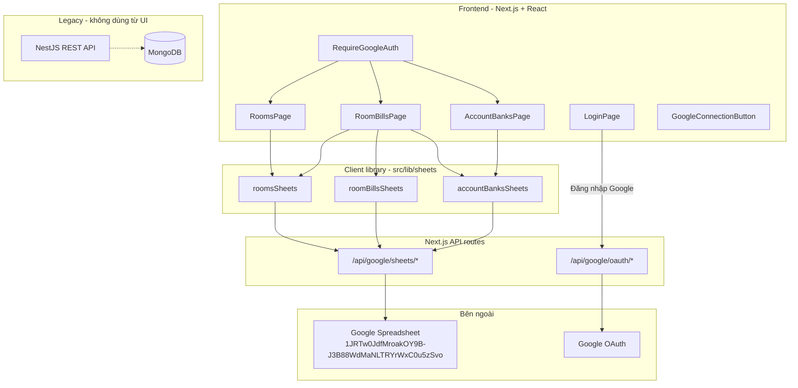
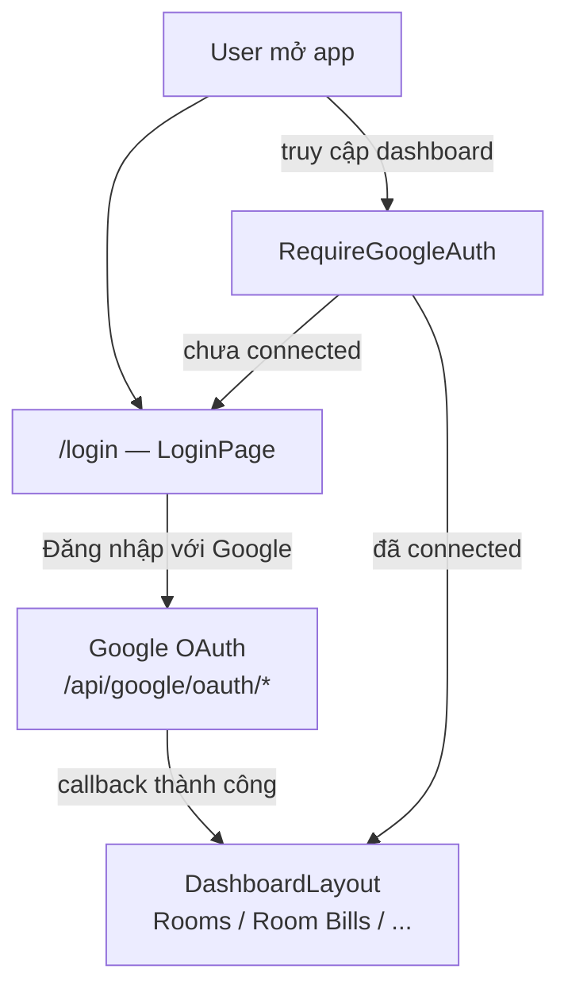
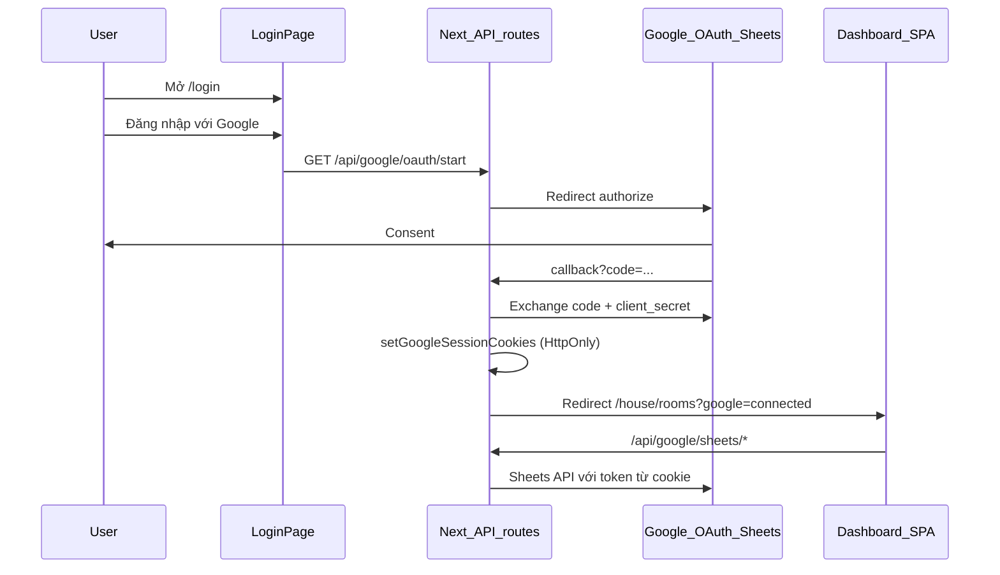

# Project Docs - Room Management

## 1) Mục tiêu

Ứng dụng quản lý phòng trọ (mặc định 2 phòng, có thể mở rộng):

- Lưu thông tin cố định của phòng.
- Lưu hóa đơn theo tháng (snapshot) để truy vết lịch sử.
- Tạo QR chuyển khoản từ tài khoản ngân hàng mặc định.

**Nguồn dữ liệu hiện tại (frontend):**

| Module | Nguồn | Ghi chú |
|--------|--------|---------|
| `rooms` | **Google Spreadsheet** — tab `rooms` | CRUD qua Next.js API + OAuth |
| `room_bills` | **Google Spreadsheet** — tab `bill_*` | Mỗi phòng một tab hóa đơn |
| `account_banks` | **Google Spreadsheet** — tab `account_banks` | CRUD + tài khoản mặc định cho QR |

**Ngoài phạm vi:**

- Chưa làm module lương/dòng tiền cá nhân.
- Chưa có auth/role đa user (hiện chỉ **Google OAuth single-user** — đăng nhập Google = session app).

---

## 2) Kiến trúc tổng quan



- **Login (Google OAuth):** màn `/login` là cổng vào; `RequireGoogleAuth` chặn toàn dashboard khi chưa kết nối Google.
- **Google Sheets OAuth:** token lưu **HttpOnly cookie** (không lưu token trên sheet).
- **Google Sheets Data Layer:** toàn bộ CRUD phòng, hóa đơn, account bank trên spreadsheet; UI gọi `src/lib/sheets/*`.

**Backend NestJS + MongoDB** vẫn tồn tại trong repo (`backend/`, `docker-compose.yml`) nhưng **frontend không gọi** REST API backend nữa. Có thể deprecate/xóa sau.

Proxy `/api/[...path]` → Nest vẫn có trong code nhưng **không còn page nào dùng**.

---

## 3) Cấu trúc project

| Thư mục | Vai trò |
|---------|---------|
| `frontend/` | Next.js 16 + React SPA, Ant Design, React Query |
| `frontend/pages/api/google/` | OAuth + Google Sheets CRUD (server-only) |
| `frontend/src/pages/LoginPage.tsx` | Màn đăng nhập Google |
| `frontend/src/components/auth/RequireGoogleAuth.tsx` | Route guard — chặn dashboard khi chưa OAuth |
| `frontend/src/components/google/GoogleConnectionButton.tsx` | Trạng thái email + ngắt kết nối (header) |
| `frontend/src/hooks/useGoogleOAuthCallbackMessage.ts` | Toast success/error từ query `?google=`; reset bootstrap sheets |
| `frontend/src/lib/sheets/` | Library đọc/ghi sheet (thay toàn bộ data layer cũ) |
| `frontend/src/config/googleSheets.config.ts` | Spreadsheet ID, mapping cột, sheet keys |
| `frontend/src/api/googleSheets.api.ts` | OAuth status/start (LoginPage) |
| `backend/` | NestJS 10 + Mongoose — **legacy**, không dùng từ UI |
| `docker-compose.yml` | MongoDB + Backend + Frontend (tùy chọn dev) |

---

## 4) Google OAuth & Sheets (đã triển khai)

### 4.1 Setup Google Cloud (một lần)

1. [Google Cloud Console](https://console.cloud.google.com/) → tạo project (vd. `management-myself`).
2. Bật **Google Sheets API** (và **Google Drive API** nếu cần tạo tab mới).
3. **OAuth consent screen** → **External**, trạng thái **Testing**, thêm **Test users** = email Google dùng app.
4. **Credentials → OAuth client ID → Web application**:
   - **Authorized JavaScript origins:** `http://localhost:3000` (+ domain prod sau).
   - **Authorized redirect URIs:** `http://localhost:3000/api/google/oauth/callback`
5. Copy **Client ID** + **Client Secret** → `frontend/.env.local` (không commit).

**Chi phí:** Miễn phí cho use case cá nhân (Sheets API + OAuth Testing).

**Lưu ý bảo mật:** `client_secret` **bắt buộc** chạy trên server (Next API routes). Không đặt secret trong React bundle.

### 4.2 Xác thực: Public link vs OAuth

| Thao tác | Chỉ public link | Google Sheets API |
|----------|-----------------|-------------------|
| Đọc trên web / export CSV | Có | Có (cần credential) |
| Ghi qua API (append, sửa dòng, tạo tab) | **Không** | **Bắt buộc OAuth hoặc Service Account** |

App dùng **OAuth user**: bấm **Đăng nhập với Google** trên màn `/login` → token trong **HttpOnly cookie**. File spreadsheet **không cần public**; tài khoản Google đã OAuth cần quyền **Editor** trên file dữ liệu.

**Đã bỏ (so với bản plan OAuth đầu):** lưu `refresh_token` trên tab `_oauth_tokens` trong sheet — không dùng token registry trên sheet nữa.

**Đã bỏ:** `GoogleSheetsGuard` trên từng trang — thay bằng `RequireGoogleAuth` bọc toàn dashboard.

### 4.3 Biến môi trường (`frontend/.env.example`)

```bash
NEXT_PUBLIC_GOOGLE_OAUTH_CLIENT_ID=...
NEXT_PUBLIC_GOOGLE_DATA_SPREADSHEET_ID=1JRTw0JdfMroakOY9B-J3B88WdMaNLTRYrWxC0u5zSvo

GOOGLE_OAUTH_CLIENT_SECRET=...
GOOGLE_OAUTH_REDIRECT_URI=http://localhost:3000/api/google/oauth/callback
GOOGLE_DATA_SPREADSHEET_ID=1JRTw0JdfMroakOY9B-J3B88WdMaNLTRYrWxC0u5zSvo
```

Spreadsheet dữ liệu: [Google Sheet](https://docs.google.com/spreadsheets/d/1JRTw0JdfMroakOY9B-J3B88WdMaNLTRYrWxC0u5zSvo/edit)

**Lưu ý:** file env phải nằm tại **`frontend/.env.local`** (Next.js chỉ đọc env trong thư mục `frontend/`). Có thể copy từ root `.env.local` nếu cần.

### 4.4 Luồng đăng nhập & OAuth





**Routing (`App.tsx`):**

| Route | Bảo vệ | Mô tả |
|-------|--------|--------|
| `/login` | Public | Màn đăng nhập Google |
| `/`, `/house/*`, `/profile/*`, `/revenue` | `RequireGoogleAuth` | Dashboard — redirect `/login` nếu chưa OAuth |

**API OAuth:**

| Route | Mô tả |
|-------|--------|
| `GET /api/google/oauth/start` | Bắt đầu OAuth |
| `GET /api/google/oauth/callback` | Đổi code, lưu cookie; success → `/house/rooms`, lỗi → `/login` |
| `GET /api/google/oauth/status` | Trạng thái đã kết nối |
| `POST /api/google/oauth/disconnect` | Xóa session |

**UI auth:**

| Component | Vai trò |
|-----------|---------|
| `LoginPage` | Cổng vào app — nút **Đăng nhập với Google**, hướng dẫn share spreadsheet |
| `RequireGoogleAuth` | Route guard — chặn toàn dashboard khi chưa OAuth |
| `GoogleConnectionButton` | Header: tag email xanh + nút **Ngắt** → về `/login` |
| `useGoogleOAuthCallbackMessage` | Xử lý query `?google=connected|error`; reset bootstrap `rooms` + `account_banks` |

---

## 5) Cấu trúc Google Spreadsheet

Một file spreadsheet chứa tất cả dữ liệu app:

| Tab | Sheet key | Mô tả |
|-----|-----------|--------|
| `rooms` | `rooms` | Danh sách phòng |
| `bill_<tên_phòng>_<năm>` | — (theo `sheetName`) | Hóa đơn từng phòng theo năm (`billingMonth` → năm) |
| `account_banks` | `accountBanks` | Tài khoản ngân hàng nhận tiền |

### 5.1 Tab `rooms`

Một dòng = một phòng. Cột map theo `ROOM_COLUMNS` trong `googleSheets.config.ts`:

| key | Header | Ghi chú |
|-----|--------|---------|
| `_id` | ID | UUID khi tạo |
| `name` | Tên phòng | |
| `nameUser` | Người thuê | |
| `monthlyRent` | Tiền thuê | number |
| `electricityUnitPrice` | Đơn giá điện | number |
| `waterUnitPrice` | Đơn giá nước | number |
| `wifiFee` | Phí wifi | number |
| `trashFee` | Phí rác | number |
| `isActive` | Đang hoạt động | TRUE/FALSE |
| `createdAt`, `updatedAt` | ISO string | |
| `billSheetName` | Sheet hóa đơn | `bill_<sanitized_name>` — cố định lúc tạo, không đổi khi sửa tên phòng |

### 5.2 Tab `bill_<tên_phòng>_<năm>` (mỗi phòng mỗi năm một tab)

Tạo tự động khi **tạo hóa đơn đầu tiên** của phòng trong năm đó (vd. bill tháng `2026-04` → tab `bill_NAS-01_2026`). Nếu tab đã tồn tại thì append thêm dòng.

Cột map `ROOM_BILL_COLUMNS`:

`_id`, `roomId`, `billingMonth`, `electricityOldReading`, `electricityNewReading`, `electricityUsed`, `waterOldReading`, `waterNewReading`, `waterUsed`, `electricityAmount`, `waterAmount`, `wifiFee`, `trashFee`, `monthlyRent`, `otherFees` (JSON string), `note`, `totalAmount`, `createdAt`, `updatedAt`

**Ràng buộc:** mỗi tab bill — tối đa **1 hóa đơn / `billingMonth`** (kiểm tra phía client trước khi append).

**Tên tab:** `bill_{sanitize(roomName)}_{YYYY}` — năm lấy từ `billingMonth`. Tab legacy `bill_{roomName}` (không có năm) được migrate tự động khi mở màn Room Bills (`POST /api/google/sheets/migrate-bill-sheets`).

**UI Room Bills:** bắt buộc chọn phòng (mặc định phòng đầu tiên) + lọc theo năm (mặc định năm hiện tại).

### 5.3 Tab `account_banks`

Một dòng = một tài khoản ngân hàng. Cột map `ACCOUNT_BANK_COLUMNS`:

| key | Header | Ghi chú |
|-----|--------|---------|
| `_id` | ID | UUID khi tạo |
| `customerCode` | Mã khách hàng | Dùng cho VietQR |
| `customerName` | Tên khách hàng | |
| `bank` | Ngân hàng | Mã ngân hàng (vd. `MB`) |
| `accountNumber` | Số tài khoản | |
| `isDefault` | Mặc định | TRUE/FALSE — tối đa 1 tài khoản default |
| `createdAt`, `updatedAt` | ISO string | |

Tab được tạo tự động lần đầu truy cập Account Banks (`ensureSheet`).

### 5.4 Bootstrap

- `POST /api/google/sheets/bootstrap` — tạo tab `rooms` + header hàng 1 nếu chưa có.
- Tab `account_banks` bootstrap riêng qua `accountBanksSheets.ensureBootstrap()` khi load trang hoặc sau OAuth reconnect.

---

## 6) Next.js API — Google Sheets

Tất cả route dùng session OAuth từ cookie (`getAuthenticatedClient`).

| Route | Method | Mô tả |
|-------|--------|--------|
| `/api/google/sheets/read` | GET | Đọc theo `sheetKey` hoặc `sheetName` |
| `/api/google/sheets/append` | POST | Thêm dòng |
| `/api/google/sheets/update` | PATCH | Sửa theo `_id` |
| `/api/google/sheets/delete-row` | DELETE | Xóa dòng theo `_id` |
| `/api/google/sheets/ensure-sheet` | POST | Tạo tab + header (vd. `bill_*`, `account_banks`) |
| `/api/google/sheets/delete-sheet` | DELETE | Xóa tab (khi xóa phòng) |
| `/api/google/sheets/bootstrap` | POST | Khởi tạo tab `rooms` |

**Sheet keys** (`googleSheetsConfig.sheets`):

| `sheetKey` | Tab |
|------------|-----|
| `rooms` | `rooms` |
| `accountBanks` | `account_banks` |

Tab `bill_*` dùng `sheetName` trực tiếp (không có sheet key).

Payload mẫu: `{ sheetKey, row }` hoặc `{ sheetName, id, row }`.

**Server:** `frontend/src/server/google/sheetsClient.ts` — `readSheet`, `appendRow`, `updateRowById`, `deleteRowById`, `ensureSheetWithHeaders`, `deleteSheetTab`.

---

## 7) Client library `src/lib/sheets/`

Thay thế toàn bộ `rooms.api.ts`, `roomBills.api.ts`, `accountBanks.api.ts` trên UI.

```
lib/sheets/
  http.ts                 # gọi /api/google/sheets/*
  sheetNames.ts           # sanitize tên tab bill_*
  mappers/
    room.mapper.ts
    roomBill.mapper.ts    # parse otherFees JSON
    accountBank.mapper.ts
  calculations/
    roomBill.calc.ts      # port logic buildBillPayload từ backend
  pagination.ts
  roomsSheets.ts
  roomBillsSheets.ts
  accountBanksSheets.ts
  index.ts
```

| Module | Hàm chính | Hành vi |
|--------|-----------|---------|
| `roomsSheets` | `getRooms`, `createRoom`, `updateRoom`, `deleteRoom` | Tab `rooms`; tạo phòng → tab `bill_*` |
| `roomBillsSheets` | `getRoomBills`, `createRoomBill`, `updateRoomBill`, `deleteRoomBill` | Đọc/ghi tab bill; merge nhiều tab khi list all |
| `accountBanksSheets` | `getList`, `getDefault`, `create`, `setDefault`, `remove` | Tab `account_banks`; set default → clear các dòng khác |

**Pages dùng library:**

| Page | Library |
|------|---------|
| `RoomsPage.tsx` | `roomsSheets` |
| `RoomBillsPage.tsx` | `roomsSheets` + `roomBillsSheets` + `accountBanksSheets` (QR) |
| `AccountBanksPage.tsx` | `accountBanksSheets` |

**Chi tiết bổ sung:**

- `roomBillsSheets.beforeMonth` — filter bill tháng trước (auto-fill số điện/nước cũ).
- `resetRoomsSheetsBootstrap` / `resetAccountBanksSheetsBootstrap` — gọi sau OAuth reconnect.

---

## 8) Công thức tính hóa đơn

Logic trong `frontend/src/lib/sheets/calculations/roomBill.calc.ts` (port từ `backend/src/room-bills/room-bills.service.ts`):

- `electricityUsed = electricityNewReading - electricityOldReading`
- `waterUsed = waterNewReading - waterOldReading`
- `electricityAmount = electricityUsed * room.electricityUnitPrice`
- `waterAmount = waterUsed * room.waterUnitPrice`
- `wifiFee` / `trashFee` / `monthlyRent`: client truyền thì dùng giá trị truyền; không truyền thì lấy từ room (snapshot)
- `totalAmount = electricityAmount + waterAmount + wifiFee + trashFee + monthlyRent + sum(otherFees.amount)`

---

## 9) Backend NestJS + MongoDB (legacy)

### 9.1 Trạng thái

- NestJS 10 + MongoDB + Mongoose vẫn có trong `backend/`.
- **Frontend không gọi** bất kỳ REST endpoint nào (`/rooms`, `/room-bills`, `/account-banks`).
- File `rooms.api.ts`, `roomBills.api.ts` còn trong repo nhưng **không được import** từ pages.
- Proxy `pages/api/[...path].ts` vẫn tồn tại nhưng không dùng.

### 9.2 Collections (tham chiếu lịch sử)

| Collection | Trạng thái |
|------------|------------|
| `rooms` | Đã migrate → tab `rooms` |
| `room_bills` | Đã migrate → tab `bill_*` |
| `account_banks` | Đã migrate → tab `account_banks` |

Swagger (khi chạy backend): `http://localhost:3000/api-docs`

---

## 10) Cách chạy local

### Chỉ Frontend + Google Sheets (khuyến nghị)

1. Copy `frontend/.env.example` → **`frontend/.env.local`**, điền OAuth + spreadsheet ID.
2. Share spreadsheet cho email Google sẽ dùng khi **Đăng nhập với Google** (quyền Editor).
3. `cd frontend && npm install && npm run dev` → `http://localhost:3000`
4. Mở `http://localhost:3000/login` → **Đăng nhập với Google** → vào dashboard (`/house/rooms`).
5. **Restart dev server** sau khi sửa `.env.local`.

**Không cần** chạy MongoDB hay NestJS để dùng app.

### Docker Compose (tùy chọn — legacy backend)

```bash
docker compose up -d --build
```

- MongoDB: `27017`
- Backend NestJS: port 3000 (xung đột với Next.js nếu chạy cả hai local — chỉ dùng một)
- Frontend trong compose map port `5173`

### Chỉ MongoDB (dev backend legacy)

```bash
docker compose up -d mongodb
cd backend && npm install && npm run start:dev
```

---

## 11) Kiểm thử manual (Google Sheets)

1. Chưa login: mọi URL dashboard (`/house/rooms`, `/profile/account-banks`, …) → redirect `/login`.
2. **Đăng nhập với Google** trên `/login` → bootstrap tab `rooms` (nếu chưa có) → vào `/house/rooms`.
3. Tạo phòng → 1 dòng trong `rooms` + tab `bill_*` có header.
4. List / sửa / xóa phòng — dữ liệu trên Sheets, không qua backend.
5. Tạo hóa đơn → dòng mới trong tab bill; `totalAmount` khớp công thức.
6. List bills (có/không `roomId`), sửa bill, auto-fill số cũ từ tháng trước (`beforeMonth`).
7. **Account Banks** (`/profile/account-banks`): list / tạo / set default / xóa → tab `account_banks`.
8. Preview hóa đơn + QR: lấy `accountBanksSheets.getDefault()` từ Sheets.
9. **Ngắt** ở header → về `/login`; refresh dashboard → bị chặn.
10. OAuth lỗi (từ chối consent) → redirect `/login?google=error`.

---

## 12) Rủi ro & giảm thiểu

| Rủi ro | Giảm thiểu |
|--------|------------|
| List tất cả bills chậm (N tab) | Số phòng nhỏ; React Query cache; filter `roomId` chỉ đọc 1 tab |
| Đổi tên phòng vs tên tab | `billSheetName` cố định lúc tạo |
| `otherFees` mảng | JSON một cột; mapper parse an toàn |
| Nhiều account bank default | `setDefault` / `create(isDefault)` clear flag các dòng khác |
| Chưa OAuth | `RequireGoogleAuth` redirect `/login`; `LoginPage` hiển thị nút đăng nhập |
| Google API rate limit | Tránh refetch liên tục; đọc tuần tự khi merge nhiều tab |

---

## 13) Quy ước dev

- Đổi cột sheet → cập nhật `googleSheets.config.ts` + mapper tương ứng + mục 5.
- Thêm sheet key mới → thêm vào `googleSheetsConfig.sheets` + `resolveDefinition` trong `sheetsClient.ts`.
- Đổi công thức tiền → sửa `roomBill.calc.ts` và ghi rõ ở mục 8.
- Giữ snapshot theo tháng trên bill (wifi/trash/rent có thể khác room tại thời điểm lập).
- Secret OAuth chỉ trong env server; không commit `.env.local`.

---

## 14) Bước tiếp theo (gợi ý)

- Deprecate/xóa `backend/`, MongoDB, proxy Nest, và các file `*.api.ts` legacy không còn dùng.
- Thống kê tổng tiền theo tháng/quý (`RevenuePage`) — đọc từ Sheets.
- Service Account thay OAuth nếu muốn bỏ màn login (server tự ghi).
- Auth JWT / đa user nếu cần tách tài khoản app khỏi Google account.
- Cập nhật `docker-compose` cho khớp Next.js-only workflow (bỏ backend nếu không cần).
