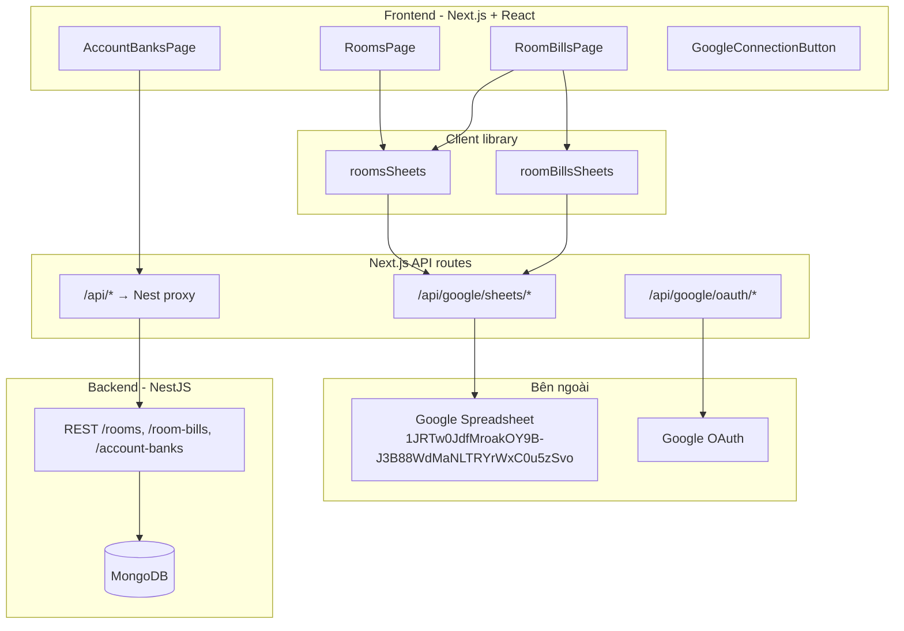
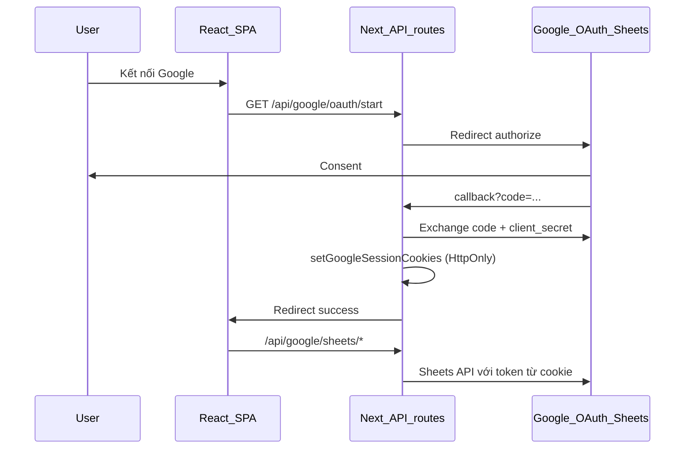

# Project Docs - Room Management

## 1) Mục tiêu

Ứng dụng quản lý phòng trọ (mặc định 2 phòng, có thể mở rộng):

- Lưu thông tin cố định của phòng.
- Lưu hóa đơn theo tháng (snapshot) để truy vết lịch sử.
- Tạo QR chuyển khoản từ tài khoản ngân hàng mặc định.

**Nguồn dữ liệu hiện tại (frontend):**

| Module | Nguồn | Ghi chú |
|--------|--------|---------|
| `rooms`, `room_bills` | **Google Spreadsheet** | CRUD qua Next.js API + OAuth |
| `account_banks` | **NestJS + MongoDB** | Vẫn gọi REST API backend |

**Ngoài phạm vi:**

- Chưa làm module lương/dòng tiền cá nhân.
- Chưa có auth/role đa user.

---

## 2) Kiến trúc tổng quan



- **Plan 1 (Google Sheets OAuth):** OAuth Google qua Next.js API, token lưu **HttpOnly cookie** (không lưu token trên sheet).
- **Plan 2 (Google Sheets Data Layer):** Toàn bộ CRUD phòng + hóa đơn trên spreadsheet; UI gọi `src/lib/sheets/*` thay `rooms.api` / `roomBills.api`.

Backend NestJS vẫn tồn tại (Swagger, MongoDB) — frontend **không** gọi `/rooms` và `/room-bills` nữa; có thể deprecate sau.

---

## 3) Cấu trúc project

| Thư mục | Vai trò |
|---------|---------|
| `frontend/` | Next.js 16 + React SPA, Ant Design, React Query |
| `frontend/pages/api/google/` | OAuth + Google Sheets CRUD (server-only) |
| `frontend/src/lib/sheets/` | Library đọc/ghi sheet (mirror API cũ) |
| `frontend/src/config/googleSheets.config.ts` | Spreadsheet ID, mapping cột |
| `backend/` | NestJS 10 + Mongoose (account banks + API legacy) |
| `docker-compose.yml` | MongoDB + Backend + Frontend |

---

## 4) Google OAuth & Sheets (đã triển khai)

### 4.1 Setup Google Cloud (một lần)

1. [Google Cloud Console](https://console.cloud.google.com/) → tạo project (vd. `management-myself`).
2. Bật **Google Sheets API** (và **Google Drive API** nếu cần tạo tab mới).
3. **OAuth consent screen** → **External**, trạng thái **Testing**, thêm **Test users** = email Google dùng app.
4. **Credentials → OAuth client ID → Web application**:
   - **Authorized JavaScript origins:** `http://localhost:3000` (+ domain prod sau).
   - **Authorized redirect URIs:** `http://localhost:3000/api/google/oauth/callback`
5. Copy **Client ID** + **Client Secret** → `frontend/.env.local` (không commit).

**Chi phí:** Miễn phí cho use case cá nhân (Sheets API + OAuth Testing).

**Lưu ý bảo mật:** `client_secret` **bắt buộc** chạy trên server (Next API routes). Không đặt secret trong React bundle.

### 4.2 Xác thực: Public link vs OAuth

| Thao tác | Chỉ public link | Google Sheets API |
|----------|-----------------|-------------------|
| Đọc trên web / export CSV | Có | Có (cần credential) |
| Ghi qua API (append, sửa dòng, tạo tab) | **Không** | **Bắt buộc OAuth hoặc Service Account** |

App dùng **OAuth user**: bấm **Kết nối Google** một lần → token trong **HttpOnly cookie**. File spreadsheet **không cần public**; tài khoản Google đã OAuth cần quyền **Editor** trên file dữ liệu.

**Đã bỏ (so với bản plan OAuth đầu):** lưu `refresh_token` trên tab `_oauth_tokens` trong sheet — không dùng token registry trên sheet nữa.

### 4.3 Biến môi trường (`frontend/.env.example`)

```bash
NEXT_PUBLIC_GOOGLE_OAUTH_CLIENT_ID=...
NEXT_PUBLIC_GOOGLE_DATA_SPREADSHEET_ID=1JRTw0JdfMroakOY9B-J3B88WdMaNLTRYrWxC0u5zSvo

GOOGLE_OAUTH_CLIENT_SECRET=...
GOOGLE_OAUTH_REDIRECT_URI=http://localhost:3000/api/google/oauth/callback
GOOGLE_DATA_SPREADSHEET_ID=1JRTw0JdfMroakOY9B-J3B88WdMaNLTRYrWxC0u5zSvo
```

Spreadsheet dữ liệu: [Google Sheet](https://docs.google.com/spreadsheets/d/1JRTw0JdfMroakOY9B-J3B88WdMaNLTRYrWxC0u5zSvo/edit)

### 4.4 Luồng OAuth



**API OAuth:**

| Route | Mô tả |
|-------|--------|
| `GET /api/google/oauth/start` | Bắt đầu OAuth |
| `GET /api/google/oauth/callback` | Đổi code, lưu cookie |
| `GET /api/google/oauth/status` | Trạng thái đã kết nối |
| `POST /api/google/oauth/disconnect` | Xóa session |

**UI:** `GoogleConnectionButton`, `GoogleSheetsGuard` — bắt buộc kết nối Google trước khi CRUD phòng/hóa đơn.

---

## 5) Cấu trúc Google Spreadsheet

### 5.1 Tab `rooms`

Một dòng = một phòng. Cột map theo `ROOM_COLUMNS` trong `googleSheets.config.ts`:

| key | Header | Ghi chú |
|-----|--------|---------|
| `_id` | ID | UUID khi tạo |
| `name` | Tên phòng | |
| `nameUser` | Người thuê | |
| `monthlyRent` | Tiền thuê | number |
| `electricityUnitPrice` | Đơn giá điện | number |
| `waterUnitPrice` | Đơn giá nước | number |
| `wifiFee` | Phí wifi | number |
| `trashFee` | Phí rác | number |
| `isActive` | Đang hoạt động | TRUE/FALSE |
| `createdAt`, `updatedAt` | ISO string | |
| `billSheetName` | Sheet hóa đơn | `bill_<sanitized_name>` — cố định lúc tạo, không đổi khi sửa tên phòng |

### 5.2 Tab `bill_<tên_phòng>` (mỗi phòng một tab)

Tạo tự động khi **tạo phòng**. Cột map `ROOM_BILL_COLUMNS`:

`_id`, `roomId`, `billingMonth`, `electricityOldReading`, `electricityNewReading`, `electricityUsed`, `waterOldReading`, `waterNewReading`, `waterUsed`, `electricityAmount`, `waterAmount`, `wifiFee`, `trashFee`, `monthlyRent`, `otherFees` (JSON string), `note`, `totalAmount`, `createdAt`, `updatedAt`

**Ràng buộc:** mỗi tab bill — tối đa **1 hóa đơn / `billingMonth`** (kiểm tra phía client trước khi append).

**Tên tab:** `sheetNames.ts` — sanitize theo quy tắc Google (tối đa 100 ký tự, loại `:/\?*[]`, prefix `bill_`).

### 5.3 Bootstrap

- `POST /api/google/sheets/bootstrap` — tạo tab `rooms` + header hàng 1 nếu chưa có.
- Tab `gid=984233398` trong link cũ **không bị xóa**; dữ liệu mới dùng tab tên `rooms`.

---

## 6) Next.js API — Google Sheets

Tất cả route dùng session OAuth từ cookie (`getAuthenticatedClient`).

| Route | Method | Mô tả |
|-------|--------|--------|
| `/api/google/sheets/read` | GET | Đọc theo `sheetName` |
| `/api/google/sheets/append` | POST | Thêm dòng |
| `/api/google/sheets/update` | PATCH | Sửa theo `_id` |
| `/api/google/sheets/delete-row` | DELETE | Xóa dòng theo `_id` |
| `/api/google/sheets/ensure-sheet` | POST | Tạo tab + header (vd. `bill_*`) |
| `/api/google/sheets/delete-sheet` | DELETE | Xóa tab (khi xóa phòng) |
| `/api/google/sheets/bootstrap` | POST | Khởi tạo tab `rooms` |

Payload mẫu: `{ sheetName, row }` hoặc `{ sheetName, id, row }`.

**Server:** `frontend/src/server/google/sheetsClient.ts` — `readSheetRange`, `appendRow`, `updateRowById`, `deleteRowById`, `ensureSheetWithHeaders`, `deleteSheetTab`.

---

## 7) Client library `src/lib/sheets/`

Thay thế `rooms.api.ts` / `roomBills.api.ts` trên UI — **cùng signature** để pages không đổi nhiều logic.

```
lib/sheets/
  http.ts                 # gọi /api/google/sheets/*
  sheetNames.ts           # sanitize tên tab bill_*
  mappers/
    room.mapper.ts
    roomBill.mapper.ts    # parse otherFees JSON
  calculations/
    roomBill.calc.ts      # port logic buildBillPayload từ backend
  pagination.ts
  roomsSheets.ts
  roomBillsSheets.ts
  index.ts
```

| Hàm | Hành vi |
|-----|---------|
| `roomsSheets.getRooms` | Đọc tab `rooms`, paginate/filter client-side |
| `roomsSheets.createRoom` | UUID + `ensure-sheet` tab bill + append `rooms` |
| `roomsSheets.updateRoom` / `deleteRoom` | update/xóa dòng; xóa phòng → xóa tab bill |
| `roomBillsSheets.getRoomBills` | Có `roomId` → 1 tab; không có → merge tất cả tab bill |
| `roomBillsSheets.createRoomBill` | `roomBill.calc` + append; chặn trùng `billingMonth` |
| `beforeMonth` | Filter bill tháng trước (auto-fill số điện/nước cũ) |

**Pages dùng library:**

- `RoomsPage.tsx` → `roomsSheets`
- `RoomBillsPage.tsx` → `roomsSheets` + `roomBillsSheets` + `accountBanksApi` (QR)

---

## 8) Công thức tính hóa đơn

Logic trong `frontend/src/lib/sheets/calculations/roomBill.calc.ts` (port từ `backend/src/room-bills/room-bills.service.ts`):

- `electricityUsed = electricityNewReading - electricityOldReading`
- `waterUsed = waterNewReading - waterOldReading`
- `electricityAmount = electricityUsed * room.electricityUnitPrice`
- `waterAmount = waterUsed * room.waterUnitPrice`
- `wifiFee` / `trashFee` / `monthlyRent`: client truyền thì dùng giá trị truyền; không truyền thì lấy từ room (snapshot)
- `totalAmount = electricityAmount + waterAmount + wifiFee + trashFee + monthlyRent + sum(otherFees.amount)`

---

## 9) Backend NestJS + MongoDB (legacy / account banks)

### 9.1 Công nghệ

- NestJS 10, MongoDB + Mongoose
- Validation: `class-validator`, `class-transformer`
- Swagger: `http://localhost:3000/api-docs` (khi chạy backend)

### 9.2 Collections (tham chiếu)

**`rooms`** — field: `name`, `nameUser`, `monthlyRent`, `electricityUnitPrice`, `waterUnitPrice`, `wifiFee`, `trashFee`, `isActive`, timestamps.

**`room_bills`** — field: `roomId`, `billingMonth` (`YYYY-MM`), chỉ số điện/nước, amounts, `otherFees`, `totalAmount`, timestamps. Unique: `roomId + billingMonth`.

**`account_banks`** — vẫn dùng qua API: `customerCode`, `customerName`, `bank`, `accountNumber`, `isDefault` (tối đa 1 default).

### 9.3 API backend (frontend chỉ dùng account banks)

- `POST/GET/PATCH/DELETE /rooms`, `/room-bills` — **không gọi từ UI** (dữ liệu trên Sheets)
- `POST/GET/PATCH/DELETE /account-banks` — **đang dùng** (`AccountBanksPage`, QR trên `RoomBillsPage`)

List pagination: `items` + `pagination` (`page`, `limit`, `totalItems`, `totalPages`).

---

## 10) Cách chạy local

### Frontend + Google Sheets

1. Copy `frontend/.env.example` → `frontend/.env.local`, điền OAuth + spreadsheet ID.
2. Share spreadsheet cho email Google sẽ dùng khi **Kết nối Google** (quyền Editor).
3. `cd frontend && npm install && npm run dev` → mặc định `http://localhost:3000`
4. Mở app → **Kết nối Google** → (tuỳ chọn) bootstrap tab `rooms` qua UI/guard.

### Docker Compose (MongoDB + Nest + Frontend)

```bash
docker compose up -d --build
```

- MongoDB: `27017`
- Backend: `http://localhost:3000` (Swagger `/api-docs`)
- Frontend trong compose có thể map port `5173` — nếu chạy Next local thì dùng port **3000** và cập nhật redirect URI OAuth cho khớp.

### Chỉ MongoDB (dev backend)

```bash
docker compose up -d mongodb
cd backend && npm install && npm run start:dev
```

---

## 11) Kiểm thử manual (Google Sheets)

1. Kết nối Google → bootstrap tab `rooms` (nếu chưa có).
2. Tạo phòng → 1 dòng trong `rooms` + tab `bill_*` có header.
3. List / sửa / xóa phòng — không gọi Nest `/rooms`.
4. Tạo hóa đơn → dòng mới trong tab bill; `totalAmount` khớp công thức.
5. List bills (có/không `roomId`), sửa bill, auto-fill số cũ từ tháng trước (`beforeMonth`).
6. Ngắt kết nối Google → thao tác báo lỗi / guard UI.
7. QR chuyển khoản vẫn lấy `account-banks` từ backend.

---

## 12) Rủi ro & giảm thiểu

| Rủi ro | Giảm thiểu |
|--------|------------|
| List tất cả bills chậm (N tab) | Số phòng nhỏ; React Query cache; filter `roomId` chỉ đọc 1 tab |
| Đổi tên phòng vs tên tab | `billSheetName` cố định lúc tạo |
| `otherFees` mảng | JSON một cột; mapper parse an toàn |
| Chưa OAuth | `GoogleSheetsGuard` + nút kết nối |
| Google API rate limit | Tránh refetch liên tục; đọc tuần tự khi merge nhiều tab |

---

## 13) Quy ước dev

- Đổi cột sheet → cập nhật `googleSheets.config.ts` + mapper tương ứng + mục này.
- Đổi công thức tiền → sửa `roomBill.calc.ts` và ghi rõ ở mục 8.
- Giữ snapshot theo tháng trên bill (wifi/trash/rent có thể khác room tại thời điểm lập).
- Secret OAuth chỉ trong env server; không commit `.env.local`.
- Migrate token store sang Nest/DB: giữ interface tách `http.ts` / server client để đổi base URL sau.

---

## 14) Bước tiếp theo (gợi ý)

- Đồng bộ hoặc deprecate hoàn toàn MongoDB `rooms` / `room_bills` nếu không cần backend cho 2 module này.
- Thống kê tổng tiền theo tháng/quý (đọc từ Sheets hoặc cache).
- Service Account thay OAuth nếu muốn bỏ nút "Kết nối Google" (server tự ghi).
- Auth JWT nếu cần đa user.
- Cập nhật `docker-compose` frontend port / env Google cho khớp Next.js 3000.
